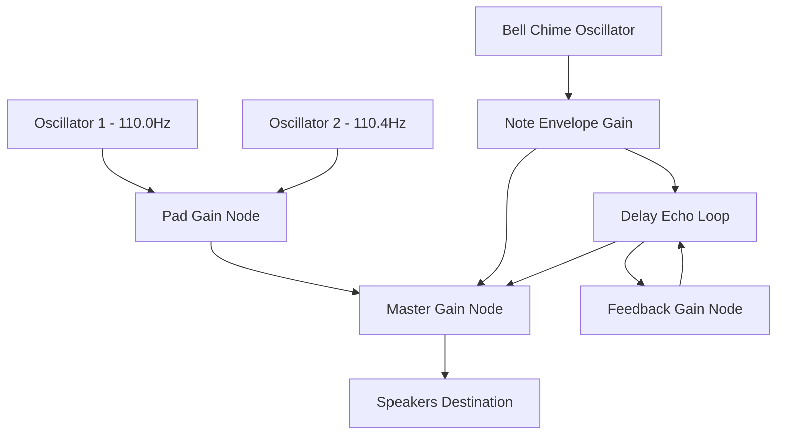

# Premium Sensory Eid Greeting Card Generator 🌙🎨

An exquisite, production-grade single-page web application designed to create, personalize, and export beautiful, high-resolution Eid greeting cards. Built with a pure client-side stack, the application features advanced typography engines, touch-compatible drag-and-drop coordinates tracking, and a **real-time Web Audio API ambient chime synthesizer** to deliver a fully immersive editing environment.

---

## 🎨 6 Curated Premium Visual Themes
Personalize your greeting card using six different programmatically drawn backdrops featuring glowing vectors and modern holiday shapes:

| Theme Name | Canvas Background | Vector Geometries & Assets | Typography Accent |
| :--- | :--- | :--- | :--- |
| **Royal Night** | Radial Deep Indigo & Navy | Golden glowing crescent moon, hanging lantern contours, glowing starfield. | `Cinzel` (Classic Serif) |
| **Emerald Grace** | Radial Emerald Green | Overlapping geometric gold mandala background, side filigree corner decorations. | `Amiri` (Arabic Calligraphy) |
| **Sunset Gold** | Vertical Purple-Orange Sunset | Silhouette mosque minarets & domes, floating warm dust particles, gold lanterns. | `Playfair Display` (Serif) |
| **Pastel Rose** | Radial Mauve & Dusty Rose | Minimalist modern gold line-art lanterns, delicate star overlays. | `Montserrat` (Clean Sans-Serif) |
| **Royal Purple** | Radial Grape & Deep Purple | Overlapping glowing geometric domes, floating gold stars, hanging lamps. | `Reem Kufi` (Kufi Calligraphy) |
| **Ivory Gold** | Radial Cream & Soft Ivory | Modern overlapping gold luxury circles, delicate crescents, gold stars. | `Cinzel` (Luxury Serif) |

---

## 🎵 Sensory Synthesizer Architecture (Web Audio API)
Rather than loading large audio files, this application programmatically synthesizes continuous background music in real-time, client-side, using the **HTML5 Web Audio API**. It is 100% immune to CORS blocks, requires zero network bandwidth, and works fully offline.



### 1. Detuned Ambient Pad
*   Two detuned `OscillatorNode` sine waves running at `110.0 Hz` and `110.4 Hz` merge to form a continuous low-end drone.
*   The minor frequency offset (`0.4 Hz`) generates a soft, natural acoustic "beat frequency" that sounds like a rich, warm synthesizer pad.

### 2. Pentatonic Bell Chimes
*   A sequencer schedules bell chimes every `1.5` to `3.0` seconds, selecting random notes from traditional Middle Eastern musical scales:
    *   **Ney Scale (Pentatonic Minor):** `[220Hz, 246Hz, 293Hz, 329Hz, 392Hz, 440Hz, 493Hz, 587Hz, 659Hz]`
    *   **Oud Scale (Hijaz / Phrygian Minor):** `[146Hz, 164Hz, 185Hz, 196Hz, 220Hz, 233Hz, 277Hz, 293Hz, 329Hz]`
*   Each note features a fast **Attack envelope** and a slow, exponential **Decay envelope** to simulate mechanical strikes:
    ```javascript
    noteGain.gain.setValueAtTime(0, audioCtx.currentTime);
    noteGain.gain.linearRampToValueAtTime(0.25, audioCtx.currentTime + 0.05); // Attack
    noteGain.gain.exponentialRampToValueAtTime(0.001, audioCtx.currentTime + 2.5); // Decay
    ```

### 3. Spacious Reverb Feedback Echo
*   Chimes pass through a dual-comb **DelayNode** (set at `600ms`) coupled to a feedback **GainNode** (set at `40%`), creating spacious, echoing chime swells that mimic natural sanctuary acoustics.

---

## 🖌️ HTML5 Canvas 2D Rendering Engine
The core rendering engine is optimized for high-fidelity exports and visual performance:

*   **Retina Resolution Backing Store:** The `<canvas>` is locked at a high resolution of `1200x1200px` to guarantee razor-sharp text and graphics when printed or shared, while using responsive CSS to dynamically scale it down to fit mobile and desktop screens.
*   **Vector Asset Drawing:** Assets are drawn programmatically using canvas math:
    *   *Mosque Domes:* Rendered using cubic Bézier curves (`bezierCurveTo`).
    *   *Mandalas & Stars:* Programmatically rotated and calculated using polar-to-rectangular trigonometry coordinates.
*   **Layer Overlap Queue:** Draws in sequential priority: Background Gradient ➡️ Vector Patterns & Assets ➡️ Bounding Boxes (if actively dragging) ➡️ Outline Strokes ➡️ Dynamic Typography Overlays.

---

## 🖱️ Drag-and-Drop Positioning Mechanics
The positioning engine tracks coordinate translations on the fly:

1.  **DPI Scaling Translation:** Translates visual screen coordinates into backing store coordinates:
    $$\text{Backing } X = (\text{client } X - \text{canvas left}) \times \left( \frac{\text{canvas width}}{\text{client width}} \right)$$
2.  **Alignment-Aware Bounding Boxes:** Clicking or touching recalculates boundaries based on text alignments (`left`, `right`, `center`):
    *   *Center:* $[X - \frac{W}{2}, X + \frac{W}{2}]$
    *   *Left:* $[X, X + W]$
    *   *Right:* $[X - W, X]$
3.  **Active Guide Indicator:** If dragging, a bounding border box (`setLineDash`) lights up to visually guide you.

---

## 🚀 How to Run Locally

You can launch and use the application immediately on your computer:
1. Open this repository folder on your computer.
2. Double-click the `index.html` file to open it in your web browser.
3. Start personalizing and generating cards!

Alternatively, you can run a lightweight development server using Node:
```bash
# Run a quick local server (if Node/NPM is installed)
npx http-server .
```

---

## 🌐 Deploy to GitHub Pages (Host for Free!)

To share this web application live with your friends and family, host it using **GitHub Pages** for free:

1. **Commit and Push changes to GitHub:**
   ```bash
   git add .
   git commit -m "Upgrade Eid Greeting Card Generator with ambient audio chimes, advanced typography styling, and 6 visual templates"
   git push origin master
   ```
2. **Enable GitHub Pages:**
   - Go to your repository on GitHub.
   - Click on the **Settings** tab.
   - On the left sidebar, click **Pages** (under the "Code and automation" section).
   - Under **Branch**, select `master` (since this repository uses `master` as its primary branch name) and folder `/ (root)`.
   - Click **Save**.
3. **Enjoy your live site!**
   - GitHub will generate a URL like `https://<your-username>.github.io/Eid_Mubarek/` where your greeting card generator is now hosted live for anyone to use!
